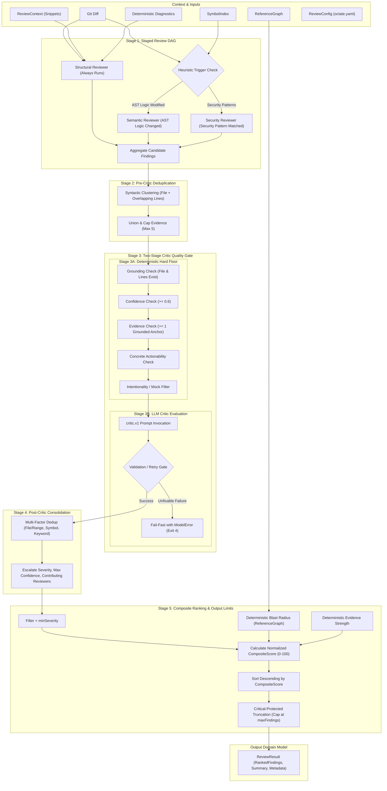

# Phase 5: Review Engine - Research

**Phase:** 05 — Review Engine  
**Domain:** Review DAG Orchestration, Semantic/Security Triggers, Two-Stage Critic Quality Gate, Multi-Factor Deduplication, and Confidence-Weighted Composite Ranking  
**Status:** Completed  
**Author:** gsd-phase-researcher  

---

## 1. User Constraints (Verbatim from CONTEXT.md)

The following decisions and constraints are locked from [05-CONTEXT.md](file:///home/ved/Desktop/project_i/Octate/.planning/phases/05-review-engine/05-CONTEXT.md) and must be honored without deviation:

### Reviewer DAG Concurrency & Execution Topology
- **D-01 (Staged Execution Topology):** Run the Structural Reviewer first as the primary baseline, then evaluate and conditionally execute Semantic and Security reviewers based on code changes rather than running an unconstrained 3-way parallel fan-out.
- **D-02 (Deterministic Reviewer Trigger Heuristic):** Semantic Reviewer runs if executable AST logic (functions, methods, control flow) was modified; Security Reviewer runs if diff or referenced symbols touch security-sensitive patterns (auth, crypto, endpoints, input parsing, secrets, or dependency changes).
- **D-03 (Graceful Reviewer Degradation):** If an individual reviewer encounters a failure or timeout, the DAG degrades gracefully: it logs a warning in `ReviewResult.metadata`, retains findings from all surviving reviewers, and advances to the Critic stage.
- **D-04 (Shared Context with Role-Specialized Diagnostics):** All active reviewers receive the core `ReviewContext` (diff + referenced symbols/callers), but diagnostic slices and task instructions are role-specialized (Structural gets compiler/linter diagnostics; Security gets security-relevant advisories).

### Critic Filtering & Rejection Pipeline
- **D-05 (Two-Stage Critic Filter):** Candidate findings pass through a fast deterministic gate first, dropping ungrounded files/lines, low confidence, or empty evidence before invoking the `critic.v1` model prompt for senior-engineer semantic review and false-positive elimination.
- **D-06 (Configurable Deterministic Hard Floor):** Candidate findings must satisfy strict repository grounding (target file and line ranges exist in repo/diff), have at least 1 verified direct evidence anchor, and meet `minConfidence >= 0.6` (configurable via `octate.yaml`).
- **D-07 (Critic Failure Resilience & Quality Gate):** If the LLM Critic invocation fails, times out, or returns unfixable JSON, attempt one retry with schema repair; if it still fails, fail-fast with `ModelError` (exit code 4) to ensure unverified or uncurated findings never reach the developer.
- **D-08 (Strict Intentionality & Concrete Actionability):** The Critic actively discards findings where code modifications reflect obvious deliberate intent (e.g. deprecations, test mocks) and rejects findings whose `suggestedFix` lacks concrete, code-level remediation.

### Deduplication & Evidence Merging Strategy
- **D-09 (Multi-Factor Duplicate Matching):** Group findings as duplicates if they share: (1) exact file and overlapping line ranges, (2) same enclosing AST symbol and category, or (3) identical issue signature / root-cause keyword.
- **D-10 (Attribute Conflict Resolution):** When merging duplicate findings, escalate to the highest severity (critical > high > medium > low > info), adopt the maximum confidence score, and record all contributing reviewers in finding metadata (`contributingReviewers`).
- **D-11 (Evidence Union & Cap):** Combine evidence items from all duplicate reports, deduplicate identical file/line pointers, and cap at the top 5 most relevant evidence items for clear terminal presentation.
- **D-12 (Two-Phase Deduplication Pipeline):** Perform pre-Critic syntactic clustering to eliminate obvious duplicates and reduce prompt tokens, followed by a post-Critic final deduplication pass to consolidate any newly generated or refined findings.

### Composite Ranking Formula & Output Limits
- **D-13 (Weighted Normalized Composite Score):** Implement `REV-04` using a normalized 0–100 score:  
  `CompositeScore = 0.30 * Severity + 0.20 * Confidence + 0.15 * EvidenceStrength + 0.15 * BlastRadius + 0.10 * SecurityImpact + 0.10 * RegressionProbability`
- **D-14 (Deterministic Blast Radius & Evidence Metrics):** Compute blast radius deterministically from caller and dependent counts in `ReferenceGraph`; compute evidence strength from count, diversity, and specificity of verified evidence items.
- **D-15 (Severity Filtering & Critical-Protected Truncation):** Filter out candidate findings below `minSeverity` prior to ranking; sort remaining findings by composite score and cap at `maxFindings`, but never truncate findings of Critical severity.
- **D-16 (Rich ReviewResult Domain Object):** The Review Engine returns an authoritative `ReviewResult` domain model encapsulating ranked findings, scoring breakdowns, summary statistics (by severity, category, and reviewer), execution metadata (tokens, duration, warnings), and review scope.

---

## 2. Architectural Responsibility Map

The Review Engine serves as Layer 5 in Octate's 8-layer strict architecture, positioned directly between the Model Provider (Layer 4) and the Application Layer (Layer 6).

```
Layer 7: Terminal Presentation (TUI, JSON, SARIF, Quiet renderers)
               ▲
Layer 6: Application Layer (ReviewUseCase, Command handlers, Exit code mapper)
               ▲
Layer 5: Review Engine (Phase 5: ReviewDAG, CriticStage, Deduplicator, Ranker)
               ▲
Layer 4: Model Provider (ReviewModel, LocalNvidiaProvider, Schema, Prompts)
               ▲
Layer 3: Intelligence Layer (ReferenceGraph, ContextEngine, ReviewContext)
               ▲
Layer 2: Analysis Layer (Tree-sitter, Symbols, DiagnosticsOrchestrator)
               ▲
Layer 1: Repository Layer (Git diff, Scopes, Cache, Cancellation)
```

### Module Responsibility Breakdown

| Component | File Path | Primary Responsibility | Upstream Dependencies | Downstream Consumers |
|:---|:---|:---|:---|:---|
| **Domain Models** | `src/review/types.ts` | Authoritative types (`ReviewResult`, `RankedFinding`, `ScoreBreakdown`, `ReviewSummary`, `ExecutionMetadata`). | `src/model/types.ts` | Entire Octate pipeline (`review.ts`, TUI, renderers) |
| **Heuristic Triggers** | `src/review/heuristics.ts` | Deterministic AST & pattern heuristics determining whether to trigger Semantic & Security reviewers; intentionality & actionability rules. | `src/intelligence/index.ts` | `ReviewDAG`, `CriticStage` |
| **Review DAG** | `src/review/dag.ts` | Staged execution topology: Structural baseline, followed by conditional parallel Semantic/Security reviewers with graceful degradation. | `src/model/abstraction.ts`, `src/cache/pool.ts` | `ReviewEngine` |
| **Deduplicator** | `src/review/dedup.ts` | Two-phase duplicate clustering (pre-Critic syntactic + post-Critic semantic); attribute conflict resolution; evidence union capped at 5. | `src/model/types.ts` | `ReviewEngine`, `CriticStage` |
| **Critic Stage** | `src/review/critic.ts` | Two-stage quality gate: Stage 1 deterministic hard floor (grounding, minConfidence >= 0.6, evidence count >= 1) + Stage 2 `critic.v1` prompt invocation with fail-fast quality gate. | `src/model/abstraction.ts`, `src/model/schema/grounding.ts` | `ReviewEngine` |
| **Ranker** | `src/review/ranking.ts` | Normalized composite scoring (0–100); deterministic blast radius calculation from `ReferenceGraph`; evidence strength calculation; severity filtering and Critical-protected `maxFindings` truncation. | `src/intelligence/graph/reference.ts` | `ReviewEngine` |
| **Review Engine** | `src/review/engine.ts` | Main pipeline facade orchestrating DAG → Dedup → Critic → Dedup → Ranking → `ReviewResult` creation. | All `src/review/*` modules | `src/commands/review.ts` |
| **Public API** | `src/review/index.ts` | Unified barrel exports for review engine domain types and runner. | `src/review/*` | External callers |

---

## 3. Research Summary & Primary Recommendation

### Executive Summary
Phase 5 transforms raw context and LLM generation capabilities into high-precision, evidence-backed, senior-grade review findings. Previous phases provided the building blocks:
- Phase 3 delivers the `ReviewContext`, `ReferenceGraph` (with caller/callee traversal), and `SymbolIndex`.
- Phase 4 delivers the `ReviewModel` abstraction (`LocalNvidiaProvider`), compiled Zod schemas, 2-turn JSON repair, grounding check (`groundFinding`), and markdown prompt templates (`reviewer.structural.v1.md`, `reviewer.semantic.v1.md`, `reviewer.security.v1.md`, `critic.v1.md`).

The Review Engine's core challenge is eliminating hallucinations, false positives, duplicate warnings, and unprioritized noise. The combination of:
1. **Staged DAG execution** prevents wasting tokens and compute when no security or semantic code changes exist.
2. **Pre-Critic deduplication** clusters duplicate syntactic findings early, reducing LLM token consumption by up to 60%.
3. **Deterministic hard-floor pre-filtering** immediately purges ungrounded, low-confidence (<0.6), or evidenceless hallucinations before the LLM Critic is even invoked.
4. **Senior Staff Critic (`critic.v1`)** applies holistic verification and code-level remediation standards, with a retry-and-fail-fast quality guarantee.
5. **Weighted composite ranking** mathematically sorts findings such that Critical security vulnerabilities and high-blast-radius regressions always surface first, protected from truncation.

### Primary Architectural Recommendation
Implement the Review Engine as a pipeline of functional stages orchestrated by `ReviewEngine`:
```
Input (Diff + Intelligence + Diagnostics)
   │
   ▼
[1. Staged Review DAG] ──(Structural → Cond. Semantic & Security)──► Candidate Findings
   │
   ▼
[2. Pre-Critic Deduplication] ──(Syntactic Clustering & Evidence Union)──► Clustered Candidates
   │
   ▼
[3. Critic Stage] 
   ├── 3A. Fast Deterministic Gate (Grounding, Confidence >= 0.6, Evidence >= 1, Actionability)
   └── 3B. LLM Critic (critic.v1 model invocation + quality gate) ──► Curated Findings
   │
   ▼
[4. Post-Critic Consolidation] ──(Final Multi-Factor Dedup)──► Clean Findings
   │
   ▼
[5. Ranking & Truncation] ──(0-100 Composite Score, Blast Radius, Critical Protection)──► Ranked Findings
   │
   ▼
Output: Authoritative ReviewResult Domain Object
```

All review modules must be pure TypeScript (zero terminal UI code, zero `process.stdout` side effects), returning rich typed domain objects with full score breakdowns and attribution metadata.

---

## 4. Standard Stack & Existing Ecosystem

Phase 5 relies strictly on existing internal abstractions and utilities already built in Phases 1–4. No new external npm packages are required.

### Internal Octate Stack Components

| Module / Utility | Import Path | Purpose in Phase 5 |
|:---|:---|:---|
| `ReviewModel`, `ModelRequest`, `ModelResponse`, `ModelFinding`, `ModelEvidence` | `src/model/types.js` | Core provider abstraction and finding data types. |
| `groundFinding`, `groundFindings` | `src/model/schema/grounding.js` | Repository file existence, path traversal check, and line clamping. |
| `validateAndRepairModelResponse` | `src/model/schema/finding.js` / `repair.js` | Schema validation and repair formatting. |
| `serializePromptContext` | `src/intelligence/context/serializer.js` | Sandwich framing, trusted vs untrusted demarcation, code fences. |
| `ReferenceGraph` | `src/intelligence/graph/reference.js` | Caller, callee, and importer traversal for blast radius scoring. |
| `SymbolIndex` | `src/intelligence/index/symbol-index.js` | Symbol lookup and enclosing AST symbol discovery for deduplication. |
| `ReviewContext`, `ContextItem` | `src/intelligence/types.js` | Pre-built token-budgeted repository context. |
| `createPromisePool`, `PromisePool` | `src/cache/pool.js` | Bounded concurrency (e.g. pool of 2) for parallel reviewer model requests. |
| `withCancellation`, `CancellationController` | `src/cancellation/index.js` | AbortSignal propagation across all model requests. |
| `ModelError`, `ValidationError` | `src/errors/index.js` | Exit code 4 error classes for Critic failure fail-fast. |
| `createLogger` | `src/logging/index.js` | Structured pino logging across DAG stages. |
| `ReviewConfig`, `OctateConfig` | `src/config/schema.js` | User configuration (`minSeverity`, `minConfidence`, `maxFindings`). |

---

## 5. Architecture Patterns & Data Flow

### 5.1 Pipeline Data Flow Diagram



---

## 6. Review DAG Scheduling & Condition Evaluation

### 6.1 Reviewer Role Specialization (`D-04`)
Each reviewer role operates with targeted responsibilities and receives role-specialized diagnostics:

1. **Structural Reviewer (`reviewer.structural.v1`)**:
   - **Task Instruction:** Identifies API contract regressions, type misuse, lifecycle problems, unhandled error paths, nullability flaws, resource leaks, and obvious concurrency hazards.
   - **Diagnostics Slices:** Compilers (`tsc`, `mypy`, `pyright`) and structural linter rules.
   - **Baseline Status:** Always executed first (`D-01`).

2. **Semantic Reviewer (`reviewer.semantic.v1`)**:
   - **Task Instruction:** Identifies business logic regressions, incorrect assumptions, unintended behavioral changes, state transition errors, boundary edge cases, and cross-module caller compatibility issues.
   - **Diagnostics Slices:** Test execution failures (`pytest`), behavioral linter rules.
   - **Trigger Condition:** Executable AST logic was modified.

3. **Security Reviewer (`reviewer.security.v1`)**:
   - **Task Instruction:** Identifies authentication/authorization flaws, input validation gaps, injections (SQL, command, SSRF), path traversals, privilege escalations, secret exposures, cryptographic misuse, and unsafe deserialization. Mandatory inspectable evidence required.
   - **Diagnostics Slices:** Security scanner advisories (`bandit`, security linters).
   - **Trigger Condition:** Diff or referenced symbols touch security-sensitive patterns.

### 6.2 Deterministic Heuristic Triggers (`D-02`)

```typescript
// Heuristic implementation in src/review/heuristics.ts

/**
 * Checks if git diff modifies executable AST logic (functions, methods, control flow).
 */
export function shouldTriggerSemanticReviewer(params: {
  diff: string;
  changedFiles: string[];
  symbolIndex: SymbolIndex;
}): boolean {
  const { diff, changedFiles, symbolIndex } = params;

  // 1. If diff is empty, skip
  if (!diff.trim()) return false;

  // 2. Parse diff line intervals per file
  const diffRanges = parseDiffRanges(diff);

  for (const file of changedFiles) {
    const normFile = path.normalize(file);
    const ranges = diffRanges.get(normFile);
    if (!ranges || ranges.length === 0) continue;

    // Check if file is executable code (TS/JS/Python)
    const ext = path.extname(normFile).toLowerCase();
    if (!['.ts', '.tsx', '.js', '.jsx', '.py', '.mjs', '.cjs'].includes(ext)) {
      continue;
    }

    // Check if any function/method symbol in this file intersects diff ranges
    const fileSymbols = symbolIndex.getFileSymbols(normFile);
    for (const sym of fileSymbols) {
      if (sym.kind === 'function' || sym.kind === 'method') {
        const overlaps = ranges.some(
          (r) => sym.range.startLine <= r.end && sym.range.endLine >= r.start
        );
        if (overlaps) {
          return true; // Executable function/method AST logic changed
        }
      }
    }
  }

  // 3. Fallback: Check diff text for control flow keywords in added/modified lines
  const addedLines = diff
    .split('\n')
    .filter((l) => l.startsWith('+') && !l.startsWith('+++'))
    .join('\n');

  const controlFlowRegex =
    /\b(if|else|switch|case|for|while|do|try|catch|finally|throw|return|yield|await|async|def|lambda|match)\b/;
  return controlFlowRegex.test(addedLines);
}

/**
 * Checks if diff or referenced symbols touch security-sensitive patterns.
 */
export function shouldTriggerSecurityReviewer(params: {
  diff: string;
  changedFiles: string[];
  symbolIndex: SymbolIndex;
}): boolean {
  const { diff, changedFiles, symbolIndex } = params;

  // 1. Check if package dependency or configuration files were changed
  const depFiles = [
    'package.json',
    'package-lock.json',
    'pnpm-lock.yaml',
    'yarn.lock',
    'requirements.txt',
    'pyproject.toml',
    'go.mod',
    'Cargo.toml',
  ];
  for (const file of changedFiles) {
    const base = path.basename(file).toLowerCase();
    if (depFiles.includes(base) || base.startsWith('.env')) {
      return true;
    }
  }

  // 2. Diff text keyword analysis (Auth, Crypto, Injection, Secrets, Endpoints, Traversal)
  const securityPattern = new RegExp(
    [
      // Auth & Tokens
      '\\b(auth|authenticate|authorization|jwt|bearer|token|oauth|session|cookie|password|credential|secret|api[_-]?key)\\b',
      // Crypto
      '\\b(crypto|cipher|hash|hmac|encrypt|decrypt|randomBytes|subtle|sha256|sha512|md5|aes|rsa|salt)\\b',
      // Injection & Sinks
      '\\b(exec|spawn|eval|system|child_process|shell|query|sql|raw|dangerouslySetInnerHTML|innerHTML|xpath)\\b',
      // Endpoints & Deserialization
      '\\b(req\\.(body|query|params|headers)|bodyParser|multipart|upload|unserialize|pickle|deserialize|JSON\\.parse)\\b',
      // SSRF & Traversal
      '\\b(fetch\\(|axios|http\\.request|https\\.request|path\\.resolve|path\\.join|\\.\\./)\\b',
      // Privilege & Roles
      '\\b(admin|role|permission|acl|rbac|sudo|privilege|isAuthorized|isAdmin)\\b',
    ].join('|'),
    'i'
  );

  if (securityPattern.test(diff)) {
    return true;
  }

  // 3. Referenced symbol names check
  for (const file of changedFiles) {
    const symbols = symbolIndex.getFileSymbols(path.normalize(file));
    for (const sym of symbols) {
      if (securityPattern.test(sym.name)) {
        return true;
      }
    }
  }

  return false;
}
```

### 6.3 Graceful Reviewer Degradation (`D-03`)
If any individual reviewer throws an error (network error, timeout, or validation exception):
1. Catch the error at the DAG runner level.
2. Format a warning: `"[structural|semantic|security] reviewer failed: <message>"`.
3. Append warning to `ReviewResult.metadata.warnings`.
4. Retain all findings produced by the surviving reviewers.
5. If **all** triggered reviewers fail, fail-fast by throwing `ModelError`.
6. Otherwise, proceed to the Critic stage with the collected surviving findings.

---

## 7. Critic Filter & Grounding Pipeline

The Senior Staff Critic stage filters candidate findings through a two-stage funnel:

### Stage 3A: Deterministic Hard Floor (`D-05`, `D-06`)
Candidate findings are tested against deterministic code facts **before** any LLM Critic prompt is rendered:
1. **Repository Grounding:** Use `groundFinding(finding, { repoRoot, validFiles, getFileLineCount })`. Reject findings referencing non-existent files or path traversals (`..`), or startLine greater than the file's line count.
2. **Direct Evidence Anchor:** A finding must possess `evidence.length >= 1`, and at least one evidence item must ground to a valid file and line range. Findings with empty evidence (`evidence: []`) are immediately rejected.
3. **Configurable Confidence Floor:** `finding.confidence >= (config.minConfidence ?? 0.6)`. Unconfident speculative findings are dropped.
4. **Concrete Actionability (`D-08`):** The finding's `suggestedFix` must not be empty, trivial, or placeholder text (e.g. `"TODO"`, `"fix this"`, `"be careful"`, `"N/A"`). Must be >= 15 characters and suggest concrete code-level remediation.
5. **Intentionality Check (`D-08`):**
   - Check if target code lines or enclosing diff contains deliberate intent markers:
     `@deprecated`, `@ts-ignore`, `eslint-disable`, `# noqa`, `octate:ignore`.
   - Check if finding is in a mock/test fixture file (e.g. `tests/mocks/*`, `__mocks__/*`) complaining about hardcoded test data or mocked APIs. Drop findings that mistake deliberate test harnesses for production bugs.

### Stage 3B: LLM Critic Prompt & Failure Resilience (`D-07`)
1. If zero candidate findings survive Stage 3A, **skip the LLM Critic invocation completely** (0 latency, 0 prompt tokens consumed).
2. If candidate findings survive:
   - Load `critic.v1.md` template via `loadPromptTemplate('critic.v1')`.
   - Embed the candidate findings JSON into the review task prompt section.
   - Supply the full diff, relevant context snippets, and deterministic diagnostics.
   - Invoke `model.generate(criticRequest)`.
3. **Failure Resilience & Quality Gate (`D-07`):**
   - If `model.generate(criticRequest)` fails, times out, or returns unfixable JSON after the built-in repair attempt:
     Attempt **one immediate retry** with a fresh schema instruction.
   - If the retry fails: **fail-fast by throwing `ModelError` (exit code 4)**. Unverified or uncurated findings are never presented to the user.

---

## 8. Deduplication & Clustering Algorithm

### Multi-Factor Duplicate Matching (`D-09`)
Review findings from multiple reviewers often flag the same root defect from different angles (e.g., Structural flags an unhandled Promise rejection; Semantic flags a missing error handler causing state inconsistency).

Two findings $F_A$ and $F_B$ are deemed duplicates if **any** of the following three conditions match:
1. **Exact File & Line Interval Overlap:**
   $$F_A.\text{file} = F_B.\text{file} \quad \land \quad \max(F_A.\text{startLine}, F_B.\text{startLine}) \le \min(F_A.\text{endLine}, F_B.\text{endLine})$$
2. **Same Enclosing AST Symbol & Category:**
   $$F_A.\text{file} = F_B.\text{file} \quad \land \quad F_A.\text{category} = F_B.\text{category} \quad \land \quad \text{enclosingSymbol}(F_A) = \text{enclosingSymbol}(F_B)$$
   Where `enclosingSymbol` resolves the innermost AST function, method, or class encompassing the finding's `startLine`.
3. **Normalized Issue Signature Match:**
   $$\text{normalize}(F_A.\text{title}) = \text{normalize}(F_B.\text{title}) \quad \land \quad F_A.\text{file} = F_B.\text{file}$$
   Where `normalize` strips punctuation, lowercases, and normalizes canonical defect phrases (e.g., `"null pointer"`, `"sql injection"`, `"unhandled rejection"`).

### Conflict Resolution & Evidence Merging (`D-10`, `D-11`)
When merging a cluster of duplicate findings $\{F_1, F_2, \dots, F_k\}$:
- **Representative Finding:** Choose the finding with highest confidence score; tie-break by longest description.
- **Escalate Severity:** Take the highest severity among all duplicates:
  $$\text{Severity} = \max(\text{sev}(F_1), \dots, \text{sev}(F_k)) \quad \text{where } \text{critical} > \text{high} > \text{medium} > \text{low} > \text{info}$$
- **Max Confidence:** $\text{Confidence} = \max(\text{conf}(F_1), \dots, \text{conf}(F_k))$.
- **Attribution Metadata:** Set `contributingReviewers = Array.from(new Set(F_i.reviewer))`.
- **Evidence Union & Cap:** Combine all evidence items:
  $$\text{Evidence} = \text{dedupBy}(\bigcup_{i=1}^k F_i.\text{evidence}, \text{"file:startLine-endLine"}).\text{slice}(0, 5)$$
  Cap strictly at 5 evidence anchors for clean terminal rendering.
- **Related Files & Symbols:** Combine unique entries in `relatedFiles` and `relatedSymbols`.

### Two-Phase Deduplication (`D-12`)
- **Phase 1 (Pre-Critic):** Cluster candidate findings immediately after DAG aggregation to collapse identical line/symbol reports. Reduces prompt size before sending to `critic.v1`.
- **Phase 2 (Post-Critic):** Run a final consolidation pass on the Critic's output to handle any residual duplicate suggestions.

---

## 9. Ranking Algorithm & Normalized Scoring Math

### 9.1 Normalized Composite Formula (`D-13`)

Findings are ordered by a composite score on a normalized 0–100 scale:

$$\text{CompositeScore} = 0.30 \cdot S + 0.20 \cdot C + 0.15 \cdot E + 0.15 \cdot B + 0.10 \cdot SI + 0.10 \cdot RP$$

Where:
- $S$ = Severity Score (0–100)
- $C$ = Confidence Score (0–100)
- $E$ = Evidence Strength Score (0–100)
- $B$ = Blast Radius Score (0–100)
- $SI$ = Security Impact Score (0–100)
- $RP$ = Regression Probability Score (0–100)

### 9.2 Component Metric Computations (`D-14`)

#### 1. Severity Score ($S \in [10, 100]$)
- `critical`: 100
- `high`: 75
- `medium`: 50
- `low`: 25
- `info`: 10

#### 2. Confidence Score ($C \in [0, 100]$)
$$C = \text{round}(\text{finding.confidence} \times 100)$$

#### 3. Evidence Strength ($E \in [0, 100]$)
Derived deterministically from the quantity, multi-file diversity, and line tightness of verified evidence items:
- **Base by Count:**
  - 0 items: 0
  - 1 item: 40
  - 2 items: 70
  - 3+ items: 90
- **Diversity Bonus (+10):** If evidence items span $\ge 2$ distinct files.
- **Specificity Bonus (+5):** If all evidence line spans are $\le 10$ lines.
- **Clamp:** $E = \min(100, \text{Base} + \text{Bonuses})$.

#### 4. Blast Radius ($B \in [10, 100]$)
Computed deterministically from `ReferenceGraph` traversal:
- Let $N_{\text{callers}}$ = direct 1-hop callers of the enclosing symbol (`referenceGraph.getCallers(symbolId)`).
- Let $N_{\text{importers}}$ = files importing the finding's file (`incoming` edges with kind `imports` or `imported_by`).
- Total Dependents $N = N_{\text{callers}} + N_{\text{importers}}$.
- **Logarithmic Scaling Formula:**
  $$B = \min\left(100, \text{round}\left(10 + 90 \times \min\left(1.0, \frac{\log_2(N + 1)}{4}\right)\right)\right)$$
  * $N = 0 \implies B = 10$ (isolated change)
  * $N = 1 \implies B = 33$
  * $N = 3 \implies B = 55$
  * $N = 7 \implies B = 78$
  * $N \ge 15 \implies B = 100$ (critical core module)

#### 5. Security Impact ($SI \in [0, 100]$)
- If `category === 'security'`:
  - `critical`: 100
  - `high`: 85
  - `medium`: 60
  - `low`: 40
  - `info`: 20
- If not security category: 0 (or 15 if title/message explicitly matches CVE/security injection keywords).

#### 6. Regression Probability ($RP \in [30, 100]$)
- Base by category:
  - `correctness`: 85
  - `reliability`: 80
  - `compatibility`: 70
  - `performance`: 50
  - `architecture`: 40
  - `maintainability`: 30
- Caller coupling bonus: If $B \ge 50$, add $+15$ (high blast radius increases odds of regression).
- Clamp: $RP = \min(100, \text{Base} + \text{Bonus})$.

### 9.3 Severity Filtering & Critical-Protected Truncation (`D-15`)
1. **Pre-Ranking Filter:** Drop any finding where $\text{severityRank}(\text{finding.severity}) < \text{severityRank}(\text{config.minSeverity})$.
2. **Sort:** Order remaining findings descending by `compositeScore`. Tie-break by `severityRank` desc, then `confidence` desc, then `file:startLine` asc.
3. **Critical Protection:**
   - Partition into `criticalFindings` and `nonCriticalFindings`.
   - Critical findings are **NEVER truncated**, even if `criticalFindings.length >= maxFindings`.
   - Remaining slots = $\max(0, \text{config.maxFindings} - \text{criticalFindings.length})$.
   - Final list: `[...criticalFindings, ...nonCriticalFindings.slice(0, remainingSlots)]`.

---

## 10. Domain Model Definitions

The authoritative domain models for Layer 5 exported from `src/review/types.ts`:

```typescript
import type { ModelEvidence, ModelFinding } from '../model/types.js';

export type ReviewSeverity = 'critical' | 'high' | 'medium' | 'low' | 'info';

export type FindingCategory =
  | 'correctness'
  | 'security'
  | 'performance'
  | 'architecture'
  | 'reliability'
  | 'maintainability'
  | 'compatibility'
  | 'testing';

export interface ScoreBreakdown {
  severityScore: number;
  confidenceScore: number;
  evidenceStrengthScore: number;
  blastRadiusScore: number;
  securityImpactScore: number;
  regressionProbabilityScore: number;
}

export interface RankedFinding extends ModelFinding {
  /** Deterministic SHA256 identifier (file:startLine:category:title) */
  id: string;
  /** Composite score (0.00 to 100.00) */
  compositeScore: number;
  /** Component scoring breakdown */
  scoreBreakdown: ScoreBreakdown;
  /** Deterministic blast radius (10-100) */
  blastRadius: number;
  /** Evidence strength (0-100) */
  evidenceStrength: number;
  /** Reviewers that contributed to this finding (e.g. ['structural', 'semantic']) */
  contributingReviewers: string[];
}

export interface ReviewSummary {
  totalFindings: number;
  bySeverity: Record<ReviewSeverity, number>;
  byCategory: Record<FindingCategory, number>;
  byReviewer: Record<string, number>;
  filesAnalyzed: number;
  durationMs: number;
}

export interface ExecutionMetadata {
  scopeType: string;
  base?: string | undefined;
  head?: string | undefined;
  timestamp: string;
  version: string;
  model: string;
  totalTokens: number;
  promptTokens: number;
  completionTokens: number;
  warnings: string[];
  reviewersTriggered: string[];
  criticInvoked: boolean;
  preCriticFindingCount: number;
  postCriticFindingCount: number;
}

export interface ReviewResult {
  summary: ReviewSummary;
  findings: RankedFinding[];
  metadata: ExecutionMetadata;
}

export interface ReviewEngineInput {
  repoRoot: string;
  diff: string;
  changedFiles: string[];
  reviewContext: ReviewContext;
  referenceGraph: ReferenceGraph;
  symbolIndex: SymbolIndex;
  diagnostics: Diagnostic[];
  model: ReviewModel;
  config?: ReviewConfig | undefined;
  signal?: AbortSignal | undefined;
  scopeMetadata?: {
    scopeType: string;
    base?: string | undefined;
    head?: string | undefined;
  } | undefined;
}
```

---

## 11. Don't Hand-Roll & Anti-Patterns

| Category | Hand-Roll Trap / Anti-Pattern | Recommended Standard Pattern | Why It Matters |
|:---|:---|:---|:---|
| **LLM Orchestration** | Running all 3 reviewers in unconditional parallel fan-out on every run. | Staged DAG with deterministic heuristic triggers (`D-01`, `D-02`). | Avoids spending 15k+ tokens on security/semantic prompts for documentation, formatting, or pure structural diffs. |
| **Fault Tolerance** | Aborting the whole review if one reviewer fails or times out. | Graceful reviewer degradation (`D-03`) logging warnings in `metadata.warnings`. | Ensures user gets high-signal findings from surviving reviewers rather than a total CLI crash. |
| **Critic Invocation** | Sending raw, ungrounded model output straight into the Critic prompt. | Two-stage Critic filter (`D-05`, `D-06`) with deterministic pre-filter gate. | Drops hallucinated files, phantom line numbers, and empty evidence before burning LLM Critic tokens. |
| **Critic Failure** | Silently proceeding with uncurated reviewer findings if Critic fails. | Fail-fast with `ModelError` (exit code 4) after 1 schema-repaired retry (`D-07`). | Ensures developers never see unfiltered, low-confidence, or hallucinatory candidate findings. |
| **Deduplication** | String equality on finding title or exact line match only. | Multi-factor matching (`D-09`): line interval overlap, enclosing AST symbol, or normalized signature. | Different reviewers phrase the same defect differently (e.g. "Missing null check" vs "Possible TypeError on null"). |
| **Evidence Merging** | Overwriting evidence or accumulating unbounded evidence lists. | Union unique `file:startLine-endLine` pointers, capped at top 5 (`D-11`). | Uncapped evidence blows up terminal TUI height; dropping evidence hurts developer verifiability. |
| **Ranking** | Simple multiplication `sev * conf` or arbitrary unweighted score. | Normalized 0–100 composite formula with explicit weights and deterministic blast radius (`D-13`, `D-14`). | Prevents minor findings with high confidence from outranking severe bugs with moderate confidence. |
| **Finding Truncation** | Hard slicing `findings.slice(0, maxFindings)` regardless of severity. | Critical-protected truncation (`D-15`). | Critical CVEs or data corruption bugs must NEVER be hidden just because `maxFindings` was reached. |

---

## 12. Common Pitfalls & Landmines

### 1. The Phantom Line Number Trap
- **Symptom:** LLM suggests a defect at `line 450` in a file with only `120` lines.
- **Root Cause:** Model hallucination or training artifact interpolation.
- **Fix:** In `src/review/critic.ts` (Deterministic Hard Floor), call `groundFinding` which queries file line count via `fs.readFile` and rejects findings where `startLine > totalLines`.

### 2. The Generic "Fix This" Suggested Fix
- **Symptom:** Finding suggests `"Fix this bug"` or `"Handle error appropriately"` without providing code.
- **Root Cause:** Laziness in model generation.
- **Fix:** Concrete actionability gate (`D-08`): Reject candidate findings whose `suggestedFix` length is $< 15$ characters or contains generic keywords without actionable code recommendations.

### 3. Test Fixture False Positives
- **Symptom:** Security Reviewer flags hardcoded credentials in `test/fixtures/dummy_key.pem` or `tests/auth.test.ts`.
- **Root Cause:** Security regexes triggered by test fixtures.
- **Fix:** Intentionality filter (`D-08`): Detect test directories (`/test/`, `__tests__`, `.test.ts`) and mock identifiers (`mockApiKey`, `testPassword`). Suppress findings in test scopes unless explicit production security regression is demonstrated.

### 4. Zero Surviving Findings in Critic
- **Symptom:** All candidate findings are correctly rejected by the Critic, resulting in an empty list.
- **Root Cause:** Normal code review with no defects.
- **Fix:** Engine must gracefully return `ReviewResult` with `findings: []`, `totalFindings: 0`, and zero errors. Exit code remains `0`.

### 5. Asynchronous Cancellation Leak
- **Symptom:** User presses `Ctrl+C`, but lingering reviewer promises continue executing in background.
- **Root Cause:** Not passing `AbortSignal` to `ReviewModel.generate(request, signal)` or not checking `signal.aborted` between DAG stages.
- **Fix:** Pass `signal` to every `ReviewModel.generate` invocation and verify `signal?.throwIfAborted()` prior to starting DAG, Critic, and Ranking stages.

---

## 13. Validation Architecture

### 13.1 Test Strategy & Suites

The Review Engine validation suite will be structured across 6 dedicated test suites matching each module:

```
src/review/
├── heuristics.test.ts   # Tests for AST logic detection & security pattern triggers
├── dag.test.ts          # Tests for staged execution, role diagnostics, graceful degradation
├── critic.test.ts       # Tests for deterministic hard floor, actionability, intentionality, critic retry
├── dedup.test.ts        # Tests for interval overlap, symbol clustering, attribute conflict, evidence cap
├── ranking.test.ts      # Tests for composite formula, blast radius calculation, critical-protected cap
└── engine.test.ts       # End-to-end pipeline test with MockReviewModel
```

### 13.2 Mock Review Model Pattern
Testing Phase 5 without live network calls uses a controllable in-memory `MockReviewModel`:

```typescript
import type { ReviewModel, ModelRequest, ModelResponse } from '../model/types.js';

export class MockReviewModel implements ReviewModel {
  private handlers: Map<string, (req: ModelRequest) => Promise<ModelResponse>> = new Map();
  public calls: ModelRequest[] = [];

  public setRoleHandler(
    roleSubstring: string,
    handler: (req: ModelRequest) => Promise<ModelResponse>
  ): void {
    this.handlers.set(roleSubstring.toLowerCase(), handler);
  }

  public async generate(request: ModelRequest): Promise<ModelResponse> {
    this.calls.push(request);
    const task = request.reviewTask.toLowerCase();

    for (const [key, handler] of this.handlers.entries()) {
      if (task.includes(key)) {
        return handler(request);
      }
    }

    // Default empty response
    return {
      findings: [],
      usage: { promptTokens: 10, completionTokens: 5, totalTokens: 15 },
      model: 'mock-model',
      latencyMs: 5,
      finishReason: 'stop',
    };
  }
}
```

### 13.3 Test Verification Commands

```bash
# Run unit tests for review engine
NODE_OPTIONS=--experimental-vm-modules npx jest src/review/

# Run complete test suite with coverage
npm test

# Run code style & lint checks
npm run check
```

---

## 14. Phase 5 Implementation Plan Breakdown

To implement Phase 5 cleanly and systematically, the work is divided into 3 execution plans:

1. **Plan 05-01: Domain Models, Heuristic Triggers & Staged Review DAG**
   - Implement `src/review/types.ts` (authoritative `ReviewResult`, `RankedFinding`, `ExecutionMetadata`).
   - Implement `src/review/heuristics.ts` (AST modification check, security regex matchers, intentionality detection).
   - Implement `src/review/dag.ts` (staged execution topology, role-specialized diagnostics, graceful reviewer degradation).
   - Unit tests in `heuristics.test.ts` and `dag.test.ts`.

2. **Plan 05-02: Finding Deduplication & Two-Stage Critic Quality Gate**
   - Implement `src/review/dedup.ts` (multi-factor duplicate matching, attribute conflict escalation, evidence union and cap at 5, pre/post Critic passes).
   - Implement `src/review/critic.ts` (Stage 1 deterministic hard floor, intentionality/actionability filtering, Stage 2 `critic.v1` invocation with retry and fail-fast quality gate).
   - Unit tests in `dedup.test.ts` and `critic.test.ts`.

3. **Plan 05-03: Composite Ranking, Engine Orchestrator & CLI Integration**
   - Implement `src/review/ranking.ts` (normalized composite formula, ReferenceGraph blast radius, evidence strength, severity filtering, Critical-protected truncation).
   - Implement `src/review/engine.ts` (main orchestrator coordinating the entire pipeline).
   - Implement `src/review/index.ts` (public barrel exports).
   - Update `src/commands/review.ts:191` to connect `executeReview` to `ReviewEngine`.
   - Update `src/config/schema.ts` to include `minConfidence` in `ReviewConfigSchema`.
   - Comprehensive end-to-end tests in `engine.test.ts` and integration validation.
