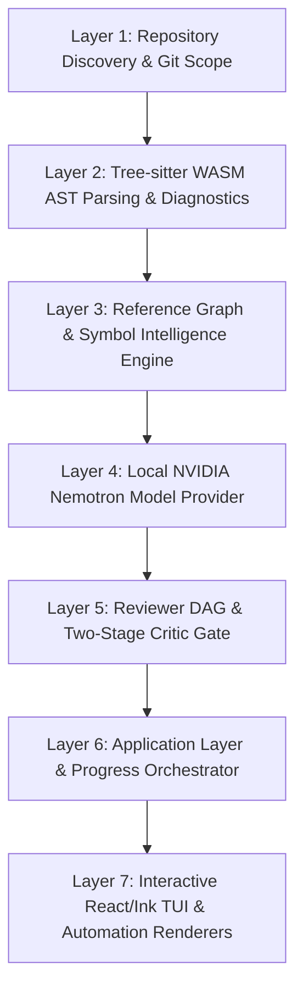

# Octate 🐙

> **Terminal-native AI code review CLI.** Deterministic repository intelligence meets LLM reasoning.

Octate is a developer-first, terminal-native AI code-review tool. Run `octate review` inside any real Git repository and receive high-value, evidence-backed findings in an interactive terminal user interface (TUI), with `--json`, `--sarif`, and `--quiet` modes for automated CI/CD workflows.

**Core Philosophy:** Understand the repository first, deterministically, and use AI reasoning over that structured understanding — not the other way around.

---

## Key Features

- 🔍 **Deterministic Pre-Analysis:** Tree-sitter WASM AST parsing, cross-file reference graphs, and static linter discovery execute locally before model inference.
- 🧠 **Multi-Stage Reviewer DAG:** Specialized reviewer roles (Security, Architecture, Performance, Correctness) reason in parallel over enriched contextual subgraphs.
- 🛡️ **Two-Stage Critic Quality Gate:** Hard floor rules eliminate hallucinations and trivial linter noise; model critic cross-examines findings against codebase conventions.
- 🖥️ **Interactive Terminal UI:** Built with Ink and React 19, featuring alternate screen buffer isolation, live progress streaming, diff inspection, and in-place re-reviews.
- ⚡ **Local-First & Zero Token Waste:** Incremental caching and smart git diff pruning mean source code never leaves your workstation and reviews run in seconds.
- 📊 **Enterprise Automation:** First-class SARIF v2.1.0 output with GitHub Code Scanning integration, machine-parseable JSON, and configurable blocking exit codes.

---

## Quickstart

Run a review immediately with zero installation required:

```bash
npx octate review
```

Or install globally:

```bash
npm install -g octate
```

Verify your environment readiness:

```bash
octate doctor
```

Initialize a project configuration file:

```bash
octate init
```

---

## CLI Reference

### `octate review [options] [refs...]`

Run code review over working tree changes, git refs, commits, or ranges.

```bash
# Review unstaged and staged working tree changes (default)
octate review

# Review only staged git changes
octate review --staged

# Review a specific commit
octate review --commit HEAD~1

# Review a revision range (PR branch against main)
octate review --range origin/main..HEAD

# Output SARIF format for CI/CD integration
octate review --sarif --no-tui > results.sarif

# Fail CI build if any critical or high findings are detected
octate review --no-tui --fail-on high
```

#### Options

| Flag | Description | Default |
| :--- | :--- | :--- |
| `--staged` | Review only staged changes | `false` |
| `--commit <hash>` | Review specific commit | `undefined` |
| `--range <rev..rev>` | Review revision range | `undefined` |
| `--branch <name>` | Review changes against target branch | `undefined` |
| `--json` | Output review results as machine-readable JSON | `false` |
| `--sarif` | Output review results as SARIF v2.1.0 | `false` |
| `-q, --quiet` | Minimal output (summary counters only) | `false` |
| `--no-tui` | Force plain-text console output instead of TUI | Auto-detected |
| `--fail-on <severity>` | Exit with code 1 if findings meet threshold (`critical`, `high`, `medium`, `low`, `none`) | `critical` |
| `-c, --config <path>` | Path to custom `octate.yaml` configuration | `octate.yaml` |
| `-d, --debug` | Enable verbose debug logging | `false` |

---

### `octate doctor [options]`

Performs comprehensive environment auditing and diagnostics.

```bash
octate doctor
```

Audits:
- Node.js runtime engine (`>= 22.0.0` required by Ink 7.1.1)
- Git repository accessibility and permissions
- PATH discovery for static analysis linters (`tsc`, `biome`, `ruff`, `mypy`, `pyright`, `bandit`, `pytest`)
- Tree-sitter WASM grammars (`typescript`, `javascript`, `python`)
- NVIDIA API connectivity & Nemotron 3 Ultra model availability without burning tokens
- Cache health and read/write operational capability

---

## Interactive TUI Keybindings

When running `octate review` in an interactive terminal, Octate launches an alternate-screen TUI workspace:

| Key | Action |
| :--- | :--- |
| `j` / `↓` | Select next finding |
| `k` / `↑` | Select previous finding |
| `Enter` / `Space` | Expand / collapse finding detail & evidence |
| `s` | Suppress / restore active finding for current session |
| `c` | Copy finding summary and file anchor to clipboard |
| `r` | Re-run review in-place (hot reload with latest edits) |
| `?` | Open interactive keyboard shortcuts modal |
| `q` / `Esc` | Exit session (evaluates exit code against unsuppressed blockers) |

---

## Architecture

Octate employs a 7-layer architecture designed for deterministic intelligence:



1. **Repository Layer:** Fast git status discovery via `isomorphic-git` and monorepo workspace boundary resolution.
2. **Analysis Layer:** Concrete syntax trees via Tree-sitter WASM with hybrid fallback to host static analysis tools.
3. **Intelligence Layer:** Scope-bounded symbol indexes and deterministic cross-file reference graphs.
4. **Model Provider:** OpenAI-compatible NVIDIA integrate endpoint supporting Nemotron 3 Ultra (`nvidia/nemotron-3-ultra-550b-a55b`).
5. **Review Engine:** Parallel DAG scheduling with two-stage Critic (hard floor heuristics + LLM Critic) guaranteeing `< 30%` false-positive rate.
6. **Application Layer:** 8-stage canonical progress streaming with strict cancellation and exception traps.
7. **Presentation Layer:** Full-screen Ink TUI with primary screen restoration guarantees and SARIF v2.1.0 generation.

---

## Documentation

- [Configuration Guide (`octate.yaml`)](docs/configuration.md)
- [CI/CD Integration & GitHub Actions SARIF Setup](docs/ci-cd.md)
- [Troubleshooting & Diagnostics](docs/troubleshooting.md)
- [v1.0 Benchmark & Evaluation Report](.planning/phases/08-cli-integration-polish-evaluation/EVALUATION.md)

---

## License

MIT © Octate Contributors
